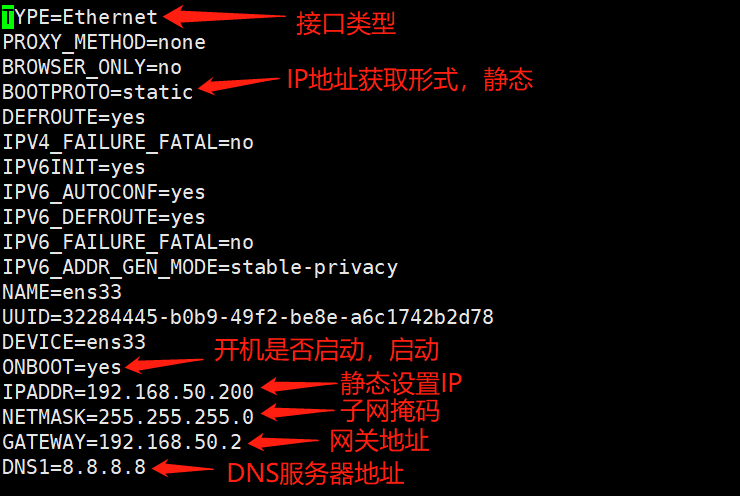
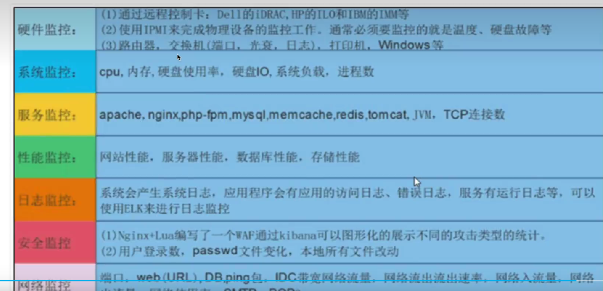
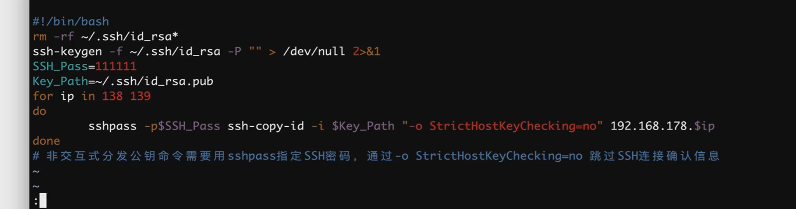
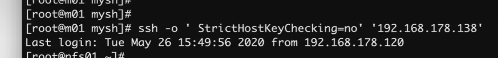
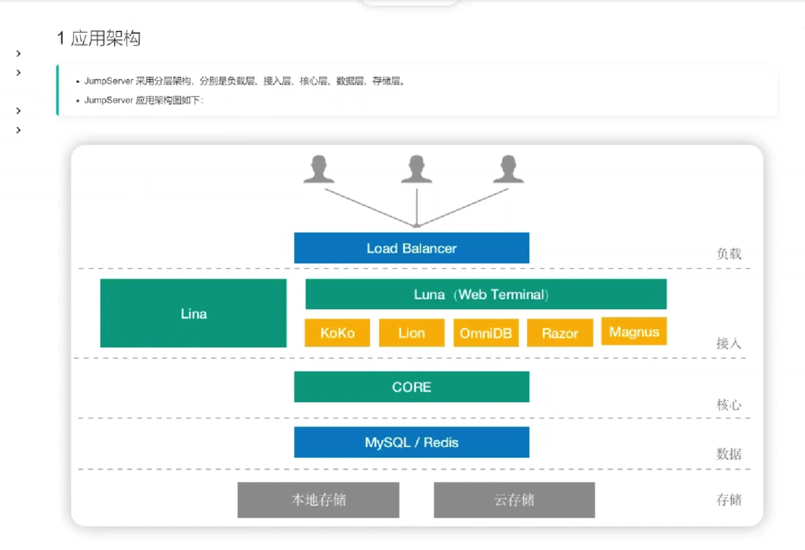

# Linux

集合基础知识以及实操经验总结Linux的使用手册

- Linux系统文件结构以及存储方式
- 指令
  - 基础
  - 常用（重点掌握）

- 实操
  - 部署
  - 调试
  - 测试


## 基础知识

本章节为Linux的必备基础知识


### Linux系统文件结构

看process文件


### 进程管理

排查必须掌握的技能

1. 查 （全局 top  lsof 、单个 ps -ef | grep）
2. 杀 ( 三种 kill -15（默认） -6（强制：危险模式） -1（重载）)
3. 挂后台
4. 


### 软件管理

两个方向

1. yum源：可理解为在线源
2. rpm管理：本地安装源码包

#### yum

```
#查询
yum list installed

#下载
yum -y xxxx（安装的名字）

#卸载
yum remove xxxx
```

#### rpm

```
#查询所有 -》查询单个用管道加grep
rpm -qa

#安装
rpm 

#卸载
rpm -e -nood 


```


### 指令


### 正则表达式（重点掌握）


### 通配符（重点掌握）


| **字符** | **说明**                                                     | **示例**                                      |
| -------- | ------------------------------------------------------------ | --------------------------------------------- |
| *        | 匹配任意字符数。 您可以在字符串中使用星号 (*****)。          | ls /opt/my*.txt                               |
| ?        | 在特定位置中匹配单个字母。                                   | ls /opt/myfis?.txt                            |
| [ ]      | 匹配方括号中的字符。[abd]，[a-z]                             | ls /opt/myfirs[a-z].txt                       |
| !        | 在方括号中排除字符 [!abcd]   [!a-z]                          | ls  myfirs[!a-g].txt                          |
| -        | 匹配一个范围内的字符。 记住以升序指定字符（A 到 Z，而不是 Z 到 A）。 | [a-z] 小写的a一直到z的序列 [A-Z]  [0-9a-zA-Z] |
| ^        | 同感叹号、在方括号中排除字符，用法和感叹号一样               | ls [^a-c]yfirst.txt                           |


### 特殊符号（重点掌握）


#### 路径

| 符号 | 作用                                                         |
| ---- | ------------------------------------------------------------ |
| ~    | 当前登录用户的家目录，对目录操作的命令,cd ,ls,touch,mkdir,find,cat |
| -    | 上一次工作路径，仅仅是在shell命令行里的作用                  |
| .    | 当前工作路径，表示当前文件夹本身；或表示隐藏文件 .yuchao.linux |
| ..   | 上一级目录                                                   |


#### 引号

引号意义，为什么要用引号

- 在于区分一个字符串的边界
- 因为linux识别，命令，参数，文件对象，中间是以空格区分的


单引号：所见即所得，无其他含义


双引号：可以解析变量、及引用、linux命令

```
echo 'hello!!*($(pwd)'   "现在时间是$(date)"
hello!!*($(pwd) 现在时间是Mon Apr 11 11:04:53 CST 2022

echo "现在时间是 $(date '+%F %T')"
现在时间是 2022-04-11 11:08:26
```

反引号：可以解析命令

```
引号嵌套
echo "当前时间是：`date '+%F %T'`"
当前时间是：2022-04-11 11:11:23

作用同上
$(linux命令)
```

无引号：一般我们都省略了双引号去写linux命令，但是会有歧义，比如空格，建议写引号


#### 重定向（位移符）


#### 其他

- ；分号
-  \# 注释
- | 管道符
- && and
- || or
- $(Linux命令) 执行linux命令
- {} 序列符
  - 字母序列
  - 数字序列
  - 文件名简写


## 新环境配置

拿到一个新的os，需要管理的配置：

- 存储体系
  - 内存
  - 外存（磁盘大小管理）

- 网络配置（网卡）
- 性能配置（cpu）
- yum源配置


#### yum源配置

```
#安装wget
yum -y install wget

#删除原有的yum配置
cd /etc/yum.repos.d/ 
rm -f * && ls

#配置yum源
#你会发现，CentOS-Base.repo默认的源，软件数量也不算多，比如nginx就找不到，它的作用类似于 你挂载光盘源，用于安装很多基础，简单的工具,而第三方的工具是没有，如nginx
wget -O /etc/yum.repos.d/CentOS-Base.repo https://mirrors.aliyun.com/repo/Centos-7.repo
#还得配置一个叫做epel仓库
wget -O /etc/yum.repos.d/epel.repo http://mirrors.aliyun.com/repo/epel-7.repo


#配置好2个仓库后，基本完事，可以安装市面绝大多数的软件了
#清空yum缓存
#生成缓存，便于后续加速下载
yum clean all 
rm -rf /var/cache/yum 
yum makecache

##!!!!!!!注意！！！！！！！！！ 关闭selinux以及firewalld （可能会导致目录数据无法写入）

#关闭selinux
grep -i 'selinux' /etc/selinux/config
sed  "/enforcing/disable/p" /etc/selinux/config

# SELINUX= can take one of these three values:
SELINUX=disabled

#关闭防火墙
systemctl stop firewalld
systemctl disable firewalld
```


#### 网络配置

- 基础网络命令
- Linux镜像系统网络连接原理
- 动态配置
- 静态配置

网卡配置文件：/etc/sysconfig/network-scripts/ifcfg-ens33


基础网络命令

```
1.查看网络配置
ip -a
ifconfig -a ---- 同上，可查看网卡配置，子网，子网掩码等

netstat ---- 一般用来看进程端口配合grep选出进程名字，例如nginx
命令格式： netstat  [选项]
选项：-a     显示主机中所有活动的网络活动信息
           -n      以数字形式显示相关的主机地址、端口等信息
           -t      查看TCP协议相关的信息
           -u     查看UDP协议相关的信息    
           -p     显示与网络连接相关联的进程号、进程名称信息
           -r      显示路由表信息
           -l      显示处于监听状态的网络连接及端口信息

netstat -anpt
Active Internet connections (servers and established)
Proto Recv-Q Send-Q Local Address           Foreign Address         State       PID/Program name    
tcp        0      0 0.0.0.0:3306            0.0.0.0:*               LISTEN      9037/docker-proxy   


2.查看主机名称
hostname
hostname [newname] ---- 临时修改
hostname set-hostname [newname] ---- 永久修改

3.管理路由
route -n ---- 查看路由配置，跟踪转发路线
route  add  -net  网段地址  gw  IP地址  dev  ens33(网卡名称） ---- 临时
route  del  -net  网段地址 ---- 删除到指定网段的路由记录
route  add / del  default  gw  IP地址 ---- 向路由表中添加 或 删除默认网关记录
/etc/sysconfig/static-routes修改此配置文件，格式为：any  net  目的网段  gw  网关 ---- 永久添加路由
配置完成需要重启网络才能生效    systemctl  restart  network

4.获取socket统计信息
ss 命令用于查看系统的网络连接情况，获取socket统计信息  （显示内容与netstat相似，但跟全面）
命令格式： ss  [ 选项 ]
选项：  
		-t         显示TCP协议的socket
		-u         显示UDP协议的socket
        -n         不解析服务的名称，如“22”端口不会显示成“ssh”
        -l          只显示处于监听状态的端口
        -p         显示监听端口的进程
        -a         显示所有端口和连接
        -r          把IP解析成域名，把端口号解析为协议名称

常用:  ss  -antp

5.测试网络连接
ping ---- ping  -c  5  www.baidu.com    ping5次baidu 自动退出，c是次数，最常用公式
curl

traceroute ---- 测试从当前主机到目的主机之间经过的网络节点
格式： traceroute  目标主机地址

nslookup ---- 测试DNS域名解析
格式：nslookup  目标主机地址 [DNS服务器地址]
例子： nslookup  www.baidu.com

dig ---- 信息更多，具体查用法


```


Linux与宿主机的关系

```
使用route可以很清楚的看懂转发关系
route -n
```


静态配置

网卡配置文件：/etc/sysconfig/network-scripts/ifcfg-ens33



配置流程

```
1.临时配置IP地址 ---- 使用命令调整网络参数
ifconfig   网卡   ip   子网掩码

特点：
简单、快速，可直接修改运行中的网络参数
一般只适合在调试网络的过程中使用
系统重启以后，所做的修改将会失效

2.永久配置IP地址 ---- 通过配置文件修改网络参数
修改网卡配置文件 ，vim /etc/sysconfig/network-scripts/网卡名，网卡名默认为ens33

!!!!!!!!!!!!!!!注意：配置网关的时候需要和宿主机一样，否则无法找到向外的口访问互联网

特点：
修改各项网络参数的配置文件
适合对服务器设置固定参数时使用
需要重载网络服务或者重启以后才会生效
 

2. 配置DNS域名解析服务器

修改DNS域名解析配置文件：vim  /etc/resolve.conf
修改完成后需要重启网卡服务：systemctl  restart  network
```


动态配置 

```
dhcp 直接用就行了，但不建议，ip每次登录都不一样
```


## 三剑客（grep - awk - sed）

- grep：过滤关键字信息。主要用于查文本内的数据
- sed  ：对文本数据继续编辑，修改原文内容
- awk ：对数据过滤，提取，并能实现格式话输出（或是美观输出）


### sed

定义：一款软件

作用：

1. 过滤指定字符
2. 取出指定字符行
3. 修改文件内容 

命令格式：

```
#sed -命令 “匹配定位 操作内容 ”  文件绝对路径
如：
删除行 sed -i "2d" /etc/a.txt
删除匹配字符串 sed -i "2,$ s/abc/cde/g" /etc/a.txt
```


| 作用       | 匹配符号                          |                            |
| ---------- | --------------------------------- | -------------------------- |
| 匹配字符串 | \\ str1\ 或者 @ @ @等，常用 \ \ \ | 如替换："2,3 s\str1\str2g" |
| 匹配第几行 | 1，2，3，4...n                    |                            |
|            |                                   |                            |


## 架构部署


#### LAMP架构（Web经典架构）

步骤：

##### 初始化系统生产环境

```
#新机器的检查
从端口与进程
netstat -tnpl | grep xx

#清空linux下的软件进行初始化
yum clean all

rm -rf /var/cache/yum
```

```
###基础软件库安装

linux很多软件的运行，依赖于操作系统本身的一些软件支持
yum groupinstall "Development tools" -y

桌面开发工具包（图形化相关包）
yum groupinstall "Desktop Platform Development" -y 

底层编译库的安装
yum install cmake make pcre-devel ncurses-devel openssl-devel libcurl-devel -y
```

```
# 安装如下基础软件，就可以解决你后面编译脚本的，绝大多数错误问题了
# 安装如下基础软件，就可以解决你后面编译脚本的，绝大多数错误问题了

yum install gcc patch libffi-devel python-devel zlib-devel bzip2-devel openssl-devel ncurses-devel sqlite-devel readline-devel tk-devel gdbm-devel db4-devel libpcap-devel xz-devel net-tools vim -y

yum install libxml2-devel  libjpeg-devel libpng-devel freetype-devel  libcurl-devel wget -y
```

##### 更改yum源（阿里云、清华等）

```
#安装wget
yum -y install wget

#配置yum源
wget -O /etc/yum.repos.d/CentOS-Base.repo https://mirrors.aliyun.com/repo/Centos-7.repo

#清空yum缓存
yum clean all

rm -rf /var/cache/yum

##!!!!!!!注意！！！！！！！！！ 关闭selinux以及firewalld （可能会导致目录数据无法写入）

#关闭selinux
grep -i 'selinux' /etc/selinux/config
# SELINUX= can take one of these three values:
SELINUX=disabled

#关闭防火墙
systemctl stop firewalld
systemctl disable firewalld
```


##### 依次安装版本适配的apache、mysql、php

```
mysql安装

1. 创建mysql用户，用于给mysql的数据，进程，设置相关的user属主
2. cd /usr/local ; mkdir software-mysql;cd software-mysql
wget -c https://repo.huaweicloud.com/mysql/Downloads/MySQL-5.6/mysql-5.6.50.tar.gz

```


```
apache安装

```


## 磁盘管理	

重要掌握，环境初始化以及增减配常用


#### 环境状态检查

##### df 命令


##### lsblk 命令


#### 分区

- GPT类型
- mbr类型

##### GPT类型（大于2TB）


##### mbr类型（小与2TB）

实践

任务：将sdb硬盘分区（20G）

- 1个主分区  (2G)
- 1个扩展分区 （剩下的全给他） 18G
- 2个逻辑分区
  - 逻辑分区1，10G
  - 逻辑分区2，剩下的都给他  8G


#### 格式化

使用mkfs命令可以进行分区，文件系统格式化。

```

1.把机器上的/dev/sdc硬盘，重新分区一个单个分区，是20G
fdisk /dev/sdc

2.给这个分区，分别格式化xfs文件系统
[yuchao-linux01 root ~]$mkfs.xfs /dev/sdc1
meta-data=/dev/sdc1              isize=512    agcount=4, agsize=1310656 blks
         =                       sectsz=512   attr=2, projid32bit=1
         =                       crc=1        finobt=0, sparse=0
data     =                       bsize=4096   blocks=5242624, imaxpct=25
         =                       sunit=0      swidth=0 blks
naming   =version 2              bsize=4096   ascii-ci=0 ftype=1
log      =internal log           bsize=4096   blocks=2560, version=2
         =                       sectsz=512   sunit=0 blks, lazy-count=1
realtime =none                   extsz=4096   blocks=0, rtextents=0


3.挂载一个目录，到这个分区，即可使用该分区，存储数据了
[yuchao-linux01 root ~]$mount /dev/sdc1 /opt/my_sdc/
[yuchao-linux01 root ~]$
[yuchao-linux01 root ~]$
[yuchao-linux01 root ~]$mount -l |grep sdc1
/dev/sdc1 on /opt/my_sdc type xfs (rw,relatime,attr2,inode64,noquota)
[yuchao-linux01 root ~]$


4.查看挂载情况
mount -l


5.设置永久挂载
上述的mount挂载命令是临时生效，需要开机就让系统自动挂载，方可实现，永久生效
编辑 /etc/fstab文件即可
[yuchao-linux01 root /opt]$tail -1 /etc/fstab 
/dev/sdc1 /opt/my_sdc xfs defaults 0 0 


6.重启机器，查看是否开机就能自动挂载，读取到/dev/sdc1磁盘的数据
再次使用mount -l |grep sdc 查看磁盘的挂载情况

以及去访问挂载点，是否能读到分区的数据即可

[yuchao-linux01 root ~]$mount -l |grep sdc
/dev/sdc1 on /opt/my_sdc type xfs (rw,relatime,attr2,inode64,noquota)
[yuchao-linux01 root ~]$
[yuchao-linux01 root ~]$
[yuchao-linux01 root ~]$
[yuchao-linux01 root ~]$ls /opt/my_sdc/


```


# 分布式版本控制系统

- git

- svn

  

## Git

 Git 是一个分布式版本控制系统，它允许开发者在本地仓库中工作，并可以将更改推送到远程仓库。

### 基础知识


### 指令

#### 连接

ssh：

#### 本地仓库的创建以及推送

```
1. cd到需要提交的文件夹

2. git init：初始化一个新的 Git 仓库。

3. git add：将文件添加到暂存区。如果使用 `.` 作为参数，则添加当前目录中的所有文件。
   #git add .

#SSH连接方式
4. git remote add origin git@github.com:SteamingBroccoli/note_base.git
5. git push -u origin master

```

#### 

#### 更新推送

```
#先保存
1. git add .  
2. git commit -m “更新内容”
2. git push origin “分支名字”
```


 

#### 查询类指令

```
git commit：提交暂存区的更改到本地仓库。可以使用 `-m` 参数来添加提交信息。
#例如：git commit -m “测试”


git reset：重置工作目录或暂存区的文件到某个历史提交。
git branch：查看和操作本地分支。
git checkout：切换到某个分支或查看某个提交的状态。

git push：将本地分支的更改推送到远程仓库。

Git 命令的组合使用可以实现更复杂的操作，例如：
git stash：保存当前工作目录的更改，以便稍后恢复。
git stash apply：应用保存的更改。
git stash drop：删除保存的更改。
git stash clear：删除所有保存的更改。
```


#### 拉取

git merge：将指定的分支合并到当前分支。
git pull：从远程仓库获取并合并分支


# 网站架构

基础概念

- 集群

- 网站负载问题
  - 负载均衡 ：负责均衡分配

- nginx代理
  - 正向代理 ：client 访问 service
  - 反向代理 ：内网节点 访问 client

- mysql转发问题

  


## 集群


# 数据库


# 服务器

Nginx高性能HTTP/Pr0xy服务器


# 自动化运维



## ansible


基础命令语句使用

```

```


#### 1.连接管理

1.1 ssh密钥模式





1.2 使用ssh，输入账号密码（麻烦）


#### 2.批量管理模式

- ad-hoc命令行 

- playbook剧本模式 （复杂场景部署，例如lnmp，rsync等） 


##### ad-hoc

​	


#### 踩坑记录(ansible缓存)

```
由于ansible在对远程主机操作之前，默认会先通过setup模块获取机器的facts（静态属性），并且会生成缓存，便于加速远程主机的操作；

但缓存也会导致一些奇怪的现象，比如客户端的机器信息更新了，服务端依旧使用的是旧数据，那就不准确了，因此可以删除缓存。

关于缓存导致bug的文章，https://serverfault.com/questions/630253/ansible-stuck-on-gathering-facts

清理ansible的缓存目录即可
[root@master-61 ~]#rm -rf ~/.ansible/cp/*
```


# 运维监控


# 容器虚拟化技术   docker与k8s


## docker

分为Linux与windos


### docker的部署（Linux）

由以下几个步骤


#### 1.配置Linux内核的流量转发功能

```
#第一步
cat <<EOF >  /etc/sysctl.d/docker.conf
net.bridge.bridge-nf-call-ip6tables = 1
net.bridge.bridge-nf-call-iptables = 1
net.ipv4.ip_forward=1
EOF

#第二步
# 加载内核防火墙模块，允许流量转发
# 加载内核防火墙功能参数1
[root@docker-01 ~]#modprobe br_netfilter
#确认有记录，就是开启了这个流量转发功能
[root@docker-01 ~]#lsmod|grep netfilter
br_netfilter           22256  0 
bridge                146976  1 br_netfilter

#第三步
# nginx优化参数
#对内核tcp参数优化
# 增加默认tcp链接数等参数修改
[root@docker-01 ~]#sysctl -p /etc/sysctl.d/docker.conf
显示：
net.bridge.bridge-nf-call-ip6tables = 1
net.bridge.bridge-nf-call-iptables = 1
net.ipv4.ip_forward = 1  
# iptables的forward转发功能就没用了

```


#### 2.安装docker

```
#极速版

cd /etc/yum.repos.d/
wget https://mirrors.aliyun.com/dockerce/linux/centos/docker-ce.repo
yum clean all && yum makecache fast
yum -y install docker-ce
systemctl enable --now docker

配置镜像加速器
https://dockerhub.azk8s.cn //Azuer 中国镜像
https://hub-mirror.c.163.com //网易云加速器

[root@jumpserver ~]# cat << EOF >> /etc/docker/daemon.json
{ "registry-mirrors": [
"https://e815eh6a.mirror.aliyuncs.com",
"https://hub-mirror.c.163.com"
]
}
EOF

systemctl daemon-reload
systemctl restart docker


==========================================================
慢速版：

# 1.基础环境配置
yum remove docker docker-common docker-selinux docker-engine
yum install yum-utils device-mapper-persistent-data lvm2

# 2
wget -O /etc/yum.repos.d/docker-ce.repo https://download.docker.com/linux/centos/docker-ce.repo

# 3
sed -i 's#download.docker.com#mirrors.tuna.tsinghua.edu.cn/docker-ce#g'  /etc/yum.repos.d/docker-ce.repo

# 4
yum makecache fast

# 5
# 安装docker-ce  社区版，免费版 docker
yum install docker-ce -y

# 6
# 启动
systemctl start docker

# 7
# 查看docker服务端进程
ps -ef|grep docker 
# 7.1 检查docker版本
[root@docker-01 ~]#docker version

# 8 
# 默认
docker pull  dockerhub 国外站点下载， 太慢

https://hub.docker.com/  #注册，然后，就会有账号密码，里面管理你自己的私有镜像。
由于是国外，太慢，配置加速器，常见方案有

#不太行
# 方案1，执行如下脚本即可
curl -sSL https://get.daocloud.io/daotools/set_mirror.sh | sh -s http://f1361db2.m.daocloud.io
========================================================================

# 方案2，用你自己的阿里云镜像加速器
#在以下这个网站查看自己的阿里云镜像加速器
https://cr.console.aliyun.com/cn-beijing/instances/mirrors


sudo mkdir -p /etc/docker
sudo tee /etc/docker/daemon.json <<-'EOF'
{
  "registry-mirrors": ["https://9yox5krg.mirror.aliyuncs.com"]
}
EOF
systemctl daemon-reload && systemctl restart docker


# 配置docker镜像下载加速器（去获取你自己的阿里云镜像站，别用别人的）
# 常见玩法
[root@docker-01 ~]#cat /etc/docker/daemon.json 
{
  "registry-mirrors": ["https://9yox5krg.mirror.aliyuncs.com"] #这是我的
}
```


#### 3.试运行nginx


```
#nginx下载 默认为最新新版
docker pull nginx


```


```
#检查这个nginx 容器进程的信息 
#容器进程，说白了，宿主机上的一个进程（被docker进程所管理的程序）
[root@alinyun ~]# docker ps
CONTAINER ID   IMAGE     COMMAND                  CREATED          STATUS          PORTS                                     NAMES
43a3f0ef26c8   nginx     "/docker-entrypoint.…"   12 minutes ago   Up 12 minutes   0.0.0.0:28877->80/tcp, :::28877->80/tcp   gifted_pare

# 这段信息，证明，容器进程，创建了容器的信息，以及名称空间，以及网络空间等
[root@docker-200 ~]#ps -ef|grep 13916

/usr/bin/containerd-shim-runc-v2
-namespace moby
-id f7bffe1c1854ec3c6c3c1d64a22d97a69414e07b5774bf44da494c219e231085
f7bffe1c1854
-address 


root      13916      1  0 11:22 ?        00:00:00 /usr/bin/containerd-shim-runc-v2 -namespace moby -id f7bffe1c1854ec3c6c3c1d64a22d97a69414e07b5774bf44da494c219e231085 -address /run/containerd/containerd.sock


root      13934  13916  0 11:22 ?        00:00:00 nginx: master process nginx -g daemon off;
root      15180  15122  0 11:45 pts/0    00:00:00 grep --color=auto 13916


# 停止容器进程试试
[root@docker-200 ~]#docker ps
CONTAINER ID   IMAGE     COMMAND                  CREATED          STATUS          PORTS                                     NAMES
f7bffe1c1854   nginx     "/docker-entrypoint.…"   24 minutes ago   Up 24 minutes   0.0.0.0:28877->80/tcp, :::28877->80/tcp   keen_kirch
[root@docker-200 ~]#

# 你可以直接基于 容器id，完整，或者最少3位，或者容器名去管理
[root@docker-200 ~]#docker stop f7b  

# 三选一都行
docker stop f7b  f7bffe1c1854  keen_kirch   # 3333

#执行停止
[root@docker-200 ~]#docker stop f7b
f7b
[root@docker-200 ~]#
[root@docker-200 ~]#

# docker ps查看运行中的容器记录
[root@docker-200 ~]#docker ps
CONTAINER ID   IMAGE     COMMAND   CREATED   STATUS    PORTS     NAMES
[root@docker-200 ~]#

# docker 容器挂掉后，数据会丢失吗？（这个容器记录是否还在，是否被删除）
#答案： 不会丢，具体要看 docker ps -a 是否还能查询到该容器记录
#查看所有的容器记录，详细信息
[root@docker-200 ~]#docker ps
CONTAINER ID   IMAGE     COMMAND   CREATED   STATUS    PORTS     NAMES
[root@docker-200 ~]#
[root@docker-200 ~]#
[root@docker-200 ~]#docker ps -a
CONTAINER ID   IMAGE     COMMAND                  CREATED          STATUS                      PORTS     NAMES
f7bffe1c1854   nginx     "/docker-entrypoint.…"   26 minutes ago   Exited (0) 57 seconds ago             keen_kirch
dc597976c0a9   nginx     "/docker-entrypoint.…"   27 minutes ago   Exited (0) 27 minutes ago             romantic_albattani


# 再次启动该容器记录
```


## docker的迁移方案

- 镜像

- 容器的数据卷

  


### 1、导出和导入容器

```
#导出容器意味着从容器的文件系统创建压缩文件，导出的文件保存为“gzip”文件。
docker export container-name | gzip > container-name.gz

#然后通过文件传输工具(如scp或rsync)将压缩文件复制到新服务器。在新服务器中，这个gzip文件随后被导入到一个新容器中。
zcat container-name.gz | docker import - container-name

#可以使用“docker run”命令访问在新服务器中创建的新容器。

#缺点
导出容器工具的一个缺点是，它不导出容器的端口和变量，也不导出包含容器的底层数据。
当尝试在另一台服务器中加载容器时，这可能会导致错误。在这种情况下，我们选择Docker镜像迁移来将容器从一台服务器迁移到另一台服务器。
```


#### 2、容器镜像迁移(重点)

```
#方法1
1.导出镜像：在源环境中运行以下命令，将镜像导出为文件。
docker save -o image.tar image_name
	docker save 表示导出镜像的命令。
	-o 表示将导出的镜像保存到指定的文件中，可指定目录-o /path/to/image.tar，若目录不存在则自动创建。
	image.tar 是将要保存的镜像文件名，可以根据需要自定义。
	image_name 是要导出的镜像名称或ID，可以根据需要替换成实际的镜像名称或ID

2.导入镜像：将导出的镜像文件传输到目标环境，并在目标环境中运行以下命令，将镜像导入。
docker load -i image.tar


#将Docker容器迁移到另一台服务器的最常用方法是迁移容器关联到的镜像。

#对于必须迁移的容器，首先使用“Docker commit”命令将其Docker镜像保存到压缩文件中。

#docker commit container-id image-name

#生成的镜像将被压缩并上传到新服务器上，在新服务器中，将使用“docker run”创建一个新容器。

#使用此方法，数据卷不会被迁移，但它会保留在容器内创建的应用程序的数据。
```


#### 3、保存和加载镜像

```
#docker镜像是应用程序的代码、库、配置文件等的包。Docker容器是由这些镜像创建的。

#可以使用“docker save”压缩镜像并将其迁移到新服务器。

#docker save image-name > image-name.tar

#在新服务器中，使用“docker load”将压缩镜像文件用于创建新镜像。

#cat image-name.tar | docker load
```


#### 4、迁移数据卷

```
#Docker容器中的数据卷是共享目录，其中包含特定于容器的数据。卷中的数据是持久的，在容器重新创建期间不会丢失。

#使用导出或提交工具将Docker容器或镜像从一台服务器迁移到另一台服务器时，不会迁移基础数据卷。

#在这种情况下，包含数据的目录将手动迁移到新服务器。然后在新服务器创建容器，引用该目录作为其数据卷。

#另一个简单的方法是通过在“docker run”命令中传递“-volumes from”参数来备份和恢复数据卷。
docker run --rm --volumes-from datavolume-name -v $(pwd):/backup image-name tar cvf backup.tar /path-to-datavolume

#这里，datavolume名称是/path/to/volume。
#此命令提供数据卷的备份。要指定工作目录，还可以指定-w/backup。
#在/backup文件夹中生成的备份可以通过scp或ftp工具复制到新服务器。然后提取复制的备份并将其还原到新容器中的数据卷中。
docker run --rm --volumes-from datavolume-name -v $(pwd):/backup image-name bash -c “cd /path-to-datavolume && tar xvf /backup/backup.tar --strip 1”
```


#### 5、迁移整个Docker容器

```
#我们在这里看到的方法适用于单个容器。但是将所有容器都要从一台服务器迁移到另一台服务器的情况下，我们采用另一种方法。

#此方法包括将整个docker目录(“/var/lib/docker”)复制到新服务器。为了使这种方法成功，需要确定几个关键点。

#保留文件夹的权限和所有权。

#迁移前停止Docker服务。

#验证两台服务器中的Docker版本是否兼容。

#迁移前后验证容器列表和功能。

#环境变量和其他配置文件的路径。

#如果此方法由于任何故障而无法工作，我们将配置自定义脚本以将容器和镜像从一台服务器迁移到另一台服务器。
```


结论：Docker容器广泛应用于DevOps和基于web托管。今天我们讨论了Docker工程师如何将Docker容器迁移到我们管理的Docker基础设施中的另一台服务器的各种方法。


# 中间件


## nginx

主要作用：

1. 请求转发实现web应用部署
2. 负载均衡(简称LB节点)

```
#在线自动生成nginx配置文件
好用的配置网站：https://www.digitalocean.com/community/tools/nginx?global.app.lang=zhCN
```


#### 请求转发的配置


##### 正向代理

```
#配置ngixn中的proxy配置
即 vim /etc/nginx/conf.d/proxy.conf 配置

#配置讲解
server {
    listen 80; #监听端口
    server_name wordpress.linux0224.cn; #匹配的域名 （访问这个域名同样能访问到这个lb）
    location / {
        proxy_pass http://172.16.1.7:8080;  #被代理的服务器端口，也就是server的端口
        include /etc/nginx/proxy_params.conf; # 转发server的时候携带的参数，同样是需要些配置文件
    }
}

# proxy转发请求，且携带，保留客户端的真实信息。
cat  /etc/nginx/proxy_params.conf 
proxy_set_header Host $http_host;
proxy_set_header X-Forwarded-For $proxy_add_x_forwarded_for;
proxy_connect_timeout 30;
proxy_send_timeout 60;
proxy_read_timeout 60;
proxy_buffering on;
proxy_buffer_size 32k;
proxy_buffers 4 128k;
```


##### 反向代理

```

```


### 负载均衡


##### nginx的特性

七层负载（对用户请求的url不同进行不同的操作）：

```
nginx支持七层（osi）负载均衡
也就是nginx支持应用层的，请求转发也就是基于 location 去匹配URL不同的URL
即进入不同的location进行不同的proxy_pass设置（server中的location可以配置匹配多种url）
```

四层负载（仅支持ip：port的转发形式）

```
#四层
物理-链路-网络-传输

```


# 堡垒机


## jumpserver


架构图：



### 连接方式

1.网页版

2.koko服务登录：也就是sshd服务

3.lion服务登录：VNC/RDP服务（远程桌面协议独立于sshd）登录


实战部署

```
1.用docker安装jumpserver


2.

```


## 部署步骤

```
1.生成随机加密秘钥
#我这里通过脚本直接生成。[root@jumpserver-no ~]# vi random_encryption.sh 
#/bin/bash
 
if [ ! "$SECRET_KEY" ]; then
  SECRET_KEY=`cat /dev/urandom | tr -dc A-Za-z0-9 | head -c 50`;
  echo "SECRET_KEY=$SECRET_KEY" >> ~/.bashrc;
  echo $SECRET_KEY;
else
  echo $SECRET_KEY;
fi  
if [ ! "$BOOTSTRAP_TOKEN" ]; then
  BOOTSTRAP_TOKEN=`cat /dev/urandom | tr -dc A-Za-z0-9 | head -c 16`;
  echo "BOOTSTRAP_TOKEN=$BOOTSTRAP_TOKEN" >> ~/.bashrc;
  echo $BOOTSTRAP_TOKEN;
else
  echo $BOOTSTRAP_TOKEN;
fi

[root@node1 ~]# bash random_encryption.sh
nEPENdlzs91OyYzUiXyTFH2lbInMbRVuwiD6m4gdnxEiXbnAuo
0XnJe5So9YDtjBi3


1.创建管理资产及资产授权
大概步骤：创建系统用户---->创建管理用户---->添加资产---->资产授权


```


# CI/CD 部署


## java

有以下几部分组成：

1. 代码仓库：gitlab（开源；代码放自己的服务器，安全性高） 所有密码：12345678


### gitlab 


##### Linux下的gitlab操作

```
1. 安装相关依赖
yum -y install policycoreutils openssh-server openssh-clients postfix

2. 启动ssh服务&设置为开机启动
systemctl enable sshd && sudo systemctl start sshd

3. 设置postfix开机自启，并启动，postfix支持gitlab发信功能
systemctl enable postfix && systemctl start postfix

4. 开放ssh以及http服务，然后重新加载防火墙列表
firewall-cmd --add-service=ssh --permanent
firewall-cmd --add-service=http --permanent
firewall-cmd --reload
如果关闭防火墙就不需要做以上配置

5. 下载gitlab包，并且安装
在线下载安装包：
wget https://mirrors.tuna.tsinghua.edu.cn/gitlab-ce/yum/el6/gitlab-ce-12.4.2-ce.0.el6.x86_64.rpm
安装：
rpm -i gitlab-ce-12.4.2-ce.0.el6.x86_64.rpm

6. 修改gitlab配置
vi /etc/gitlab/gitlab.rb
修改gitlab访问地址和端口，默认为80，我们改为82
23   external_url 'http://192.168.101.128:82'
1112 nginx['listen_port'] = 82

7. 重载配置及启动gitlab
gitlab-ctl reconfigure
gitlab-ctl restart

8. 把端口添加到防火墙
firewall-cmd --zone=public --add-port=82/tcp --permanent
firewall-cmd --reload
启动成功后，看到以下修改管理员root密码的页面，修改密码后，然后登录即可


9.访问http://192.168.101.128:82，修改root密码为 12345678

10.创建一个group
http://192.168.101.128:82/ci-cd_group


```


##### idea下的push

```
问题1：
跳出了 Git Credential Manager Enter credentials for http://192.168.101.128:82/t1_group/web_demo.git

方案：
需要登录账号密码，账号密码是gitlab的账号和密码
bruce 12345678
```


## Jenkins的部署

Jenkins版本：jenkins-2.190.3-1.1.noarch.rpm  #网址#  https://jenkins.io/zh/download/

```
1.软件下载
yum install java-1.8.0-openjdk* -y
#安装
rpm -ivh jenkins-2.190.3-1.1.noarch.rpm 

2.修改配置文件
vim /etc/syscofig/jenkins

#修改内容如下：
JENKINS_USER="root"
JENKINS_PORT="8888"

#启动Jenkins
systemctl start jenkins

#打开浏览器访问
http://192.168.xxx.xxx1:8888


3.配置管理员
bruce 12345678

4.配置国内update源

#Jenkins国外官方插件地址下载速度非常慢，所以可以修改为国内插件地址：
Jenkins->Manage Jenkins->Manage Plugins，点击Available

#更改配置文件
cd /var/lib/jenkins/updates
sed -i 's/http:\/\/updates.jenkinsci.org\/download/https:\/\/mirrors.tuna.tsinghua.edu.cn\/jenkins/g' default.json && sed -i 's/http:\/\/www.google.com/https:\/\/www.baidu.com/g' default.json

#最后
Manage Plugins点击Advanced，把Update Site改为国内插件下载地址
https://mirrors.tuna.tsinghua.edu.cn/jenkins/updates/update-center.json

#Sumbit后
在浏览器输入： http://192.168.66.101:8888/restart ，重启Jenkins。

完成！

5.

```


# 项目部署


##  Cat

前后端分离 （springboot+tomcat+vue+uniapp）

### docker

```
[root@localhost yum.repos.d]# docker version
Client: Docker Engine - Community
 Version:           25.0.4
 API version:       1.44
 Go version:        go1.21.8
 Git commit:        1a576c5
 Built:             Wed Mar  6 16:33:16 2024
 OS/Arch:           linux/amd64
 Context:           default

Server: Docker Engine - Community
 Engine:
  Version:          25.0.4
  API version:      1.44 (minimum version 1.24)
  Go version:       go1.21.8
  Git commit:       061aa95
  Built:            Wed Mar  6 16:32:11 2024
  OS/Arch:          linux/amd64
  Experimental:     false
 containerd:
  Version:          1.6.28
  GitCommit:        ae07eda36dd25f8a1b98dfbf587313b99c0190bb
 runc:
  Version:          1.1.12
  GitCommit:        v1.1.12-0-g51d5e94
 docker-init:
  Version:          0.19.0
  GitCommit:        de40ad0

```


### 中间件

```
docker pull java:8
docker pull mysql:8.0.19
docker pull redis:6.0.8
docker pull nginx:1.18.0
docker images
```


docker images

```
[root@localhost yum.repos.d]# docker images
REPOSITORY   TAG       IMAGE ID       CREATED       SIZE
nginx        1.18.0    c2c45d506085   2 years ago   133MB
redis        6.0.8     16ecd2772934   3 years ago   104MB
mysql        8.0.19    0c27e8e5fcfa   3 years ago   546MB
java         8         d23bdf5b1b1b   7 years ago   643MB
```


mysql配置

```
1.初始配置
#密码123456
docker run --name mysql -v /myapp/mysql:/var/lib/mysql -p 3306:3306 -e MYSQL_ROOT_PASSWORD=123456 -d mysql:8.0.19

#docker ps
e25d4ca68bb85474ff1d6523b13f2895550f969fdff273ba0679adce387decdd

2.文件导入
cat.sql -> linux的myapp/mysql

3.进入MySQL容器实例，导入数据

#获取id号
# docker ps -a 
CONTAINER ID   IMAGE          COMMAND                  CREATED         STATUS         PORTS                                                  NAMES
2f170caaf744   redis:6.0.8    "docker-entrypoint.s…"   6 minutes ago   Up 6 minutes   0.0.0.0:6379->6379/tcp, :::6379->6379/tcp              redis
e25d4ca68bb8   mysql:8.0.19   "docker-entrypoint.s…"   7 minutes ago   Up 7 minutes   0.0.0.0:3306->3306/tcp, :::3306->3306/tcp, 33060/tcp   mysql

#记住id号e25d4ca68bb8

4.进入容器
#docker exec -it [容器ID] /bin/bash
docker exec -it e25d4ca68bb8 /bin/bash

```


redis

```
#密码123456 端口 6379
docker run -d --name redis -p 6379:6379 redis:6.0.8 --requirepass "123456"

```


### 后端配置

maven：3.8.6


打包jar包

```
[root@localhost ruoyi]# vim Dockerfile
[root@localhost ruoyi]# docker build -t cat:1.0 .
[+] Building 1.7s (8/8) FINISHED                                                                                  docker:default
 => [internal] load build definition from Dockerfile                                                                        0.0s
 => => transferring dockerfile: 716B                                                                                        0.0s
 => [internal] load metadata for docker.io/library/java:8                                                                   0.0s
 => [internal] load .dockerignore                                                                                           0.0s
 => => transferring context: 2B                                                                                             0.0s
 => [internal] load build context                                                                                           0.6s
 => => transferring context: 83.87MB                                                                                        0.6s
 => [1/3] FROM docker.io/library/java:8                                                                                     0.1s
 => [2/3] ADD ruoyi-admin.jar app.jar                                                                                       0.2s
 => [3/3] RUN bash -c 'touch /app.jar'                                                                                      0.7s
 => exporting to image                                                                                                      0.1s
 => => exporting layers                                                                                                     0.1s
 => => writing image sha256:fa1b9b4b553778fe4969748737aded661f38b64338be9b25351ca7c782dfd8fe                                0.0s
 => => naming to docker.io/library/cat:1.0                                                                                  0.0s
[root@localhost ruoyi]# docker images
REPOSITORY   TAG       IMAGE ID       CREATED         SIZE
cat          1.0       fa1b9b4b5537   7 seconds ago   811MB
nginx        1.18.0    c2c45d506085   2 years ago     133MB
redis        6.0.8     16ecd2772934   3 years ago     104MB
mysql        8.0.19    0c27e8e5fcfa   3 years ago     546MB
java         8         d23bdf5b1b1b   7 years ago     643MB
[root@localhost ruoyi]# docker  run -d --name cat -p 8085:8085 cat:1.0
3c43775a25d3aeea12a1eebf3ecd2b648b8218fcc1660a8ce4d582d5ab993a9c
```

成功部署！


### 前端部署


1.nginx镜像部署

因为需要nginx的初始化配置文件，为了保证不出错，

所以我们直接启动一个nginx容器，把配置文件拉取下来，然后删除容器！

```
1.创建nginx工作目录
#需要一个conf文件存放目录，和html文件目录,及日志存放目录
mkdir -p /data/applications/nginx/conf
mkdir -p /data/applications/nginx/html
mkdir -p /data/logs

2.启动nginx容器，如果这个镜像本机中没有，会自动下载镜，我这下载是的1.18版本
docker run --name nginx -p 80:80 -d nginx:1.18.0

3.复制容器中配置文件目录到本机中，然后删除该容器
# 复制配置
docker cp nginx:/etc/nginx/nginx.conf /data/applications/nginx/conf/nginx.conf
docker cp nginx:/etc/nginx/conf.d /data/applications/nginx/conf/conf.d
docker cp nginx:/usr/share/nginx/html /data/applications/nginx/
 
#先用 [docker ps – a] 命令 找到对应容器ID
#才可以删除容器
docker rm -f [容器ID]
[root@localhost ruoyi]# docker ps -a
CONTAINER ID   IMAGE          COMMAND                  CREATED          STATUS          PORTS                                                  NAMES
08651dc267ba   nginx:1.18.0   "/docker-entrypoint.…"   2 minutes ago    Up 2 minutes    0.0.0.0:80->80/tcp, :::80->80/tcp                      nginx
3c43775a25d3   cat:1.0        "java -Djava.securit…"   5 minutes ago    Up 5 minutes    0.0.0.0:8085->8085/tcp, :::8085->8085/tcp              cat
2f170caaf744   redis:6.0.8    "docker-entrypoint.s…"   32 minutes ago   Up 32 minutes   0.0.0.0:6379->6379/tcp, :::6379->6379/tcp              redis
e25d4ca68bb8   mysql:8.0.19   "docker-entrypoint.s…"   32 minutes ago   Up 32 minutes   0.0.0.0:3306->3306/tcp, :::3306->3306/tcp, 33060/tcp   mysql

id：08651dc267ba

4.启动新的nginx容器

#报错
docker run -d \
-p 80:80 \
-p 443:443 \
--name nginx \
--restart=always \
--network-alias nginx \
-e TZ="Asia/Shanghai" \
-v /data/applications/nginx/conf/nginx.conf:/etc/nginx/nginx.conf \
-v /data/applications/nginx/conf/conf.d:/etc/nginx/conf.d \
-v /data/logs/nginx:/var/log/nginx \
-v /data/applications/nginx/html:/usr/share/nginx/html \
-v /data/applications/nginx/cert:/etc/nginx/cert \
nginx:1.18.0

#正确
docker run -d \
-p 80:80 \
-p 443:443 \
--name nginx \
--restart=always \
-e TZ="Asia/Shanghai" \
-v /data/applications/nginx/conf/nginx.conf:/etc/nginx/nginx.conf \
-v /data/applications/nginx/conf/conf.d:/etc/nginx/conf.d \
-v /data/logs/nginx:/var/log/nginx \
-v /data/applications/nginx/html:/usr/share/nginx/html \
-v /data/applications/nginx/cert:/etc/nginx/cert \
nginx:1.18.0

#报错了
报错原因：
设置网络别名（列表），自定义网络模式才有效，否则报错“network-scoped aliases are only supported for user-defined networks”。

#解决
删除该句，因为本机器是桥接模式没有使用自定义，所以删除这个 --network-alias nginx \

```


## 前后端分离+负载均衡（springboot+tomcat+vue+uniapp）


### 前后端分离+负载均衡+（docker+springboot+tomcat+vue+uniapp）

